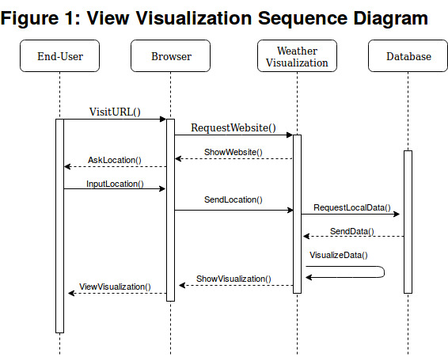
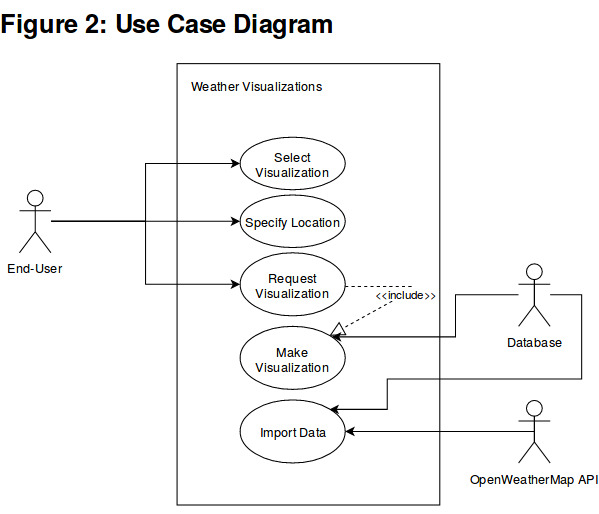

# Requirements Doc
### Weather Visualizations
#### Josh Alexander, John Connolly, Chris Kasza

## 1. Preface
### 1.1 Revision History
| Version | Date       | Comment                               |
| -------:|:----------:| ------------------------------------- |
| 1.1     | 2019-03-05 | Add context in sections where lacking |
| 1.0     | 2019-02-26 | Initial description                   |

### 1.2 Audience
This document is written for the developers of this software project as a reference point of what should be developed and delivered and to avoid feature creep. Considering this software project is being developed as a requirement of the class, COMP 3663 X2, at Acadia University, it is expected that the professor, and possible teaching assistants, will read the document as well.

## 2. Introduction
Our system will serve up weather visualizations to clients via a user-friendly website. Our system interfaces with the OpenWeatherMap API to serve up the visualizations, and the system itself is a combination of front-end and back-end sub-systems. Our system attempts to achieve our overall goal of providing interesting and helpful weather graphs for a variety of clients.

Our system will be more focused on easy to generate historical visualizations than weather forecasts. There are many easy to find websites that provide weather forecast data and visualizations. In comparison, generating charts representing historical weather data in a aesthetic and customizable way is harder to find. 

## 3. Glossary
**API:** Application programming interface, an interface containing clearly defined methods for communication between programs, websites, data sets, etc.

**Backend:** Refers to the portion of the web application that runs on a server. Think of the user's browser as the client and the backend is the server the client connects to. The backend handles the interaction with the database, any heavy computations, and delivering data to the frontend.

**Django:** An MVT (model-view-template) framework written in Python. Provides both a backend and a frontend but the system being built will only use Django to deliver an API.

**Framework:** A framework is a generic abstraction/platform that provides functionality that is usually focused on *ease of programming* or the ability to make beautiful things easily (when dealing with web frameworks). 

**Frontend:** Refers to the portion of a web application that a user directly interfaces with. The portion that renders on in the user's web browser.

**HTML/CSS/JavaScript:** These are all programming languages that makeup websites. HTML (hypertext markup language) is the content, CSS (cascading stylesheets) is the styling, and JavaScript is extra functionality, like animations, events, etc.

**Nuxt.js:** A JavaScript framework that extends the functionality of the Vue.js framework. It allows for rapid development and delivery of a modern JavaScript frontend.

**OpenWeatherMap:** An online service that provides weather data via an API. There are free and paid tiers to their service.

**VPS:** Virtual Private Server. A virtual machine provided as a rentable service via a web host such as DigitalOcean or Linode.

## 4. User requirements definition
4.1. The system shall be accessible as a web application from anywhere in the Canada provided the user has a computer with an Internet connection and a modern web browser (Firefox, Chrome, Safari, Opera, Microsoft Edge, etc.).

4.2. The system shall not require authentication or user accounts. Users access the services provided by the web application on demand with ease.

4.3 The system shall determine the user's current geographic location if location services are permitted via the web browser. 

4.4. Upon initially browsing to the web application, the user will receive the current weather information for their geographic location if the location service is enabled; otherwise, the system will default to Toronto, ON, the center of the country.

4.5. The system shall provide the user the ability to change the location from the default to any other community in Canada. Changing the community will automatically display the current weather for the selected community.

4.6. The system shall provide the ability two display two temperature charts.

4.6.1. The first temperature chart will display line graph with temperature displayed in the Y-axis and time in the X-axis. The user will select the start and end time for the time frame.

4.6.2. The second chart will also display a line graph of temperature. The difference is that the user chooses two time frames to compare. The user will select the start time for each time frame and then specify a duration that will be used for both.

## 5. System architecture
The system architecture will follow modern techniques for building web sites. Specifically the frontend and backend will be divided into their own services.  The frontend is written in HTML/CSS/JavaScript. The CSS framework, Bulma, is being leveraged along with the Nuxt.js, a JavaScript framework built on top of Vue.js. The backend will be written in Python and use the Django framework.  The system gathers information from OpenWeatherMaps API rather building a weather station and collecting our own data.  The staging site for the backend is Heroku.com and for the frontend it is Netlify.com. The production server will be a custom build on a DigitalOcean VPS. The database to hold the data gathered from the API is PostgreSQL

## 6. System requirements specification

### 6.1. Functional Requirements:
The application must provide varied weather graphs.  
The application must be hosted on and accessible via the web. 
The application must be viewable on a variety of devices (mobile, tablet, desktop, TV, etc).
The application must be highly availible and not experience downtimes.

### 6.2. Non-functional requirements:
Three months of part time developer time is not sufficient to produce a fully functioning weather application to compete in the existing market space.
Hypothetically, if the application was fully implemented and could compete in the market, the resources used to host it are not configured to scale to meet demand. And the group is not in a position to pay for the underlying compute power to support a scaling solution.

## 7. System models

## 8. System evolution

The system is not expected to have hundreds of clients per day, but should be ready to expand easily in the event of increased demand. 

The free version of OpenWeatherMap allows for 60 responses per minute, we would have to purchase a plan for more requests if they become neccessary due to high demand. We can not afford this, so this is a limiting factor for our system.

The database contains just data from the OpenWeatherMap, and we are right now not planning on storing anything else. The rate of expansion required for the database should be constant, and there are no foreseen rapid expansions planned.

The system will only provide Canadian weather data to start. It is out of the scope of this project to provide international weather data. However, this could be an evolution that may come up later.

## 9. Appendix

The minimal requirements for the end-user are simply the requirements to run a modern browser. 

Our database is using PostgreSQL, the layout is extremely simple, just a single table.

The hardware specifications of our DigitalOcean droplet is: 
1 vCPUs
1GB / 25GB Disk

## 10. Index
### Figures Index
Figure 1: View Visualization Sequence Diagram

Figure 2: Use-case Diagram
