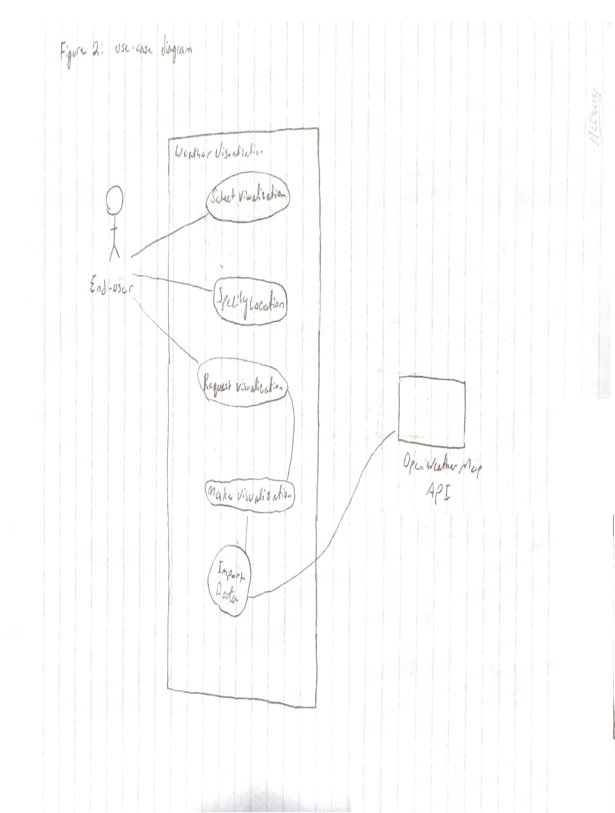

# Requirements Doc
### Weather Visualizations
#### Josh Alexander, John Connolly, Chris Kasza

## Introduction
Our system will serve up weather visualizations to clients via a user-friendly website. Our system interfaces with the OpenWeatherMap API to serve up the visualizations, and the system itself is a combination of front-end and back-end sub-systems. Our system attempts to achieve our overall goal of providing interesting and helpful weather graphs for a variety of clients.

Our system will be more focused on easy to generate historical visualizations than weather forecasts. There are many easy to find websites that provide weather forecast data and visualizations. In comparison, generating charts representing historical weather data in a aesthetic and customizable way is harder to find. 

## Glossary
**Data visualization:** A way of displaying data in a comprehensible manner for human consumption.

**API:** Application programming interface, an interface containing clearly defined methods for communication between programs, websites, data sets, etc.

**OpenWeatherMap:** An online service that provides free weather data via an API.

**HTML/CSS/JavaScript:** These are all programming languages that makeup websites. HTML is the content, CSS is the styling, and Javascript is extra functionality, like animations, events, etc.

**Framework:** A framework is a generic abstraction/platform that provides functionality that is usually focused on *ease of programming* or the ability to make beautiful things easily (when dealing with web frameworks). 

## User requirements definition
The project provides the end user an easy to navigate interface to explore weather data for communities in Canada with a variety of different visualizations. That data can be reviewed using different charts for single time frames, as well as comparison charts for two timeframes.

## System architecture
The system architecture will follow modern techniques for building webpages. Specifically the frontend and backend will be divided into their own services.  The frontend is written in HTML/CSS/JavaScript. The CSS framework, Bulma, is being leveraged along with the Nuxt.js, a JavaScript framework built on top of Vue.js. The backend will be written in python and use the django framework.  The staging site for the backend is Heroku.com and for the frontend it is Netlify.com. The production server will be a custom build on a DigitalOcean.com VPS. The database to hold the data gathered from the API is PostgreSQL

## System requirements specification

### Functional Requirements:
The application must provide varied weather graphs.  
The application must be hosted on and accessible via the web. 
The application must be viewable on a variety of devices (mobile, tablet, desktop, TV, etc).

### Non-functional requirements:
Three months of part time developer time is not sufficient to produce a fully functioning weather application to compete in the existing market space.
Hypothetically, if the application was fully implemented and could compete in the market, the resources used to host it are not configured to scale to meet demand. And the group is not in a position to pay for the underlying compute power to support a scaling solution.

## System models

## System evolution

The system is not expected to have hundreds of clients per day, but should be ready to expand easily in the event of increased demand. 

The free version of OpenWeatherMap allows for 60 responses per minute, we would have to purchase a plan for more requests if they become neccessary due to high demand. We can not afford this, so this is a limiting factor for our system.

The database contains just data from the OpenWeatherMap, and we are right now not planning on storing anything else. The rate of expansion required for the database should be constant, and there are no foreseen rapid expansions planned.

The system will only provide Canadian weather data to start. It is out of the scope of this project to provide international weather data. However, this could be an evolution that may come up later.

## Appendix

The minimal requirements for the end-user are simply the requirements to run a modern browser. 

Our database is using PostgreSQL, the layout is extremely simple, just a single table.

The hardware specifications of our DigitalOcean droplet is: 
1 vCPUs
1GB / 25GB Disk

## Index
### Figures Index
Figure 1: View Visualization Sequence Diagram

Figure 2: Use-case Diagram
