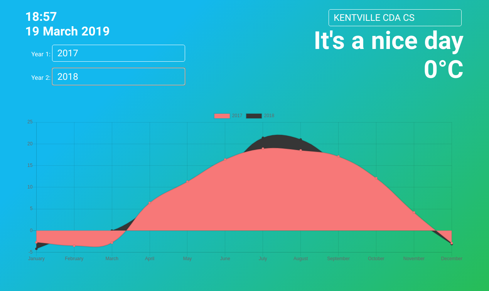

# UI Design
### Weather Visualizations
#### Joshua Alexander, John Connolly, Chris Kasza

## Use Cases

1. Change community
   - click the field outlined in white in top right corner of the UI
   
   - current weather and weather chart is updated
   
2. View historical weather chart for one year
   - on the left side of the UI, click one of the fields outlined in white and select a year
   
   - in the other outlined field, choose the first option (a blank entry)
   - the chart updates, displaying data for the selected year
   
3. Compare historical weather for two years
   - on the left side of the UI, click one of the fields outlined in white and select a year
   
   - in the other outlined field, choose a different year
   
   - the chart updates, displaying data for the selected years
   
